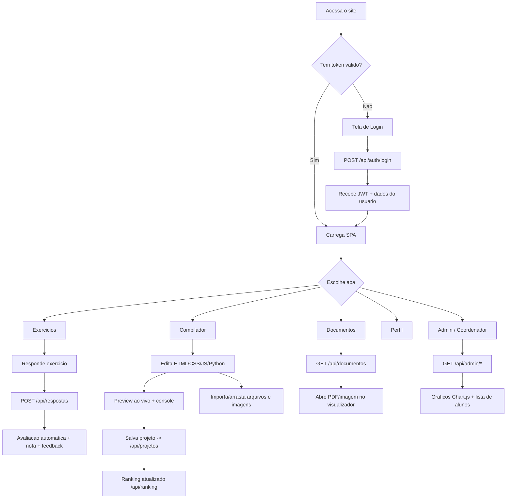

# 🎓 ADS Anhanguera — Plataforma Educacional

<p align="center">
  
  
  
  
  
  
  
  
</p>

Plataforma educacional completa para o curso de **Análise e Desenvolvimento de Sistemas** da **Universidade Anhanguera**. Reúne exercícios interativos com avaliação automática, um **compilador/IDE web** (HTML, CSS, JavaScript e Python) com IntelliSense, suporte a imagens e Live Server, **ranking gamificado** de alunos, painel administrativo com gráficos, biblioteca de documentos por unidade e um explorador de arquivos do projeto.

---

## 📋 Índice

- [Funcionalidades](#-funcionalidades)
- [Fluxo do Projeto e do Site](#-fluxo-do-projeto-e-do-site)
- [Arquitetura](#-arquitetura)
- [Tecnologias](#-tecnologias)
- [Estrutura do Projeto](#-estrutura-do-projeto)
- [Instalação Local](#-instalação-local)
- [Variáveis de Ambiente](#-variáveis-de-ambiente)
- [Deploy na Vercel](#-deploy-na-vercel)
- [Autenticação e Roles](#-autenticação-e-roles)
- [API Endpoints](#-api-endpoints)
- [Regras de Negócio](#-regras-de-negócio)
- [Banco de Dados](#-banco-de-dados)
- [Conteúdo Acadêmico](#-conteúdo-acadêmico)
- [Desenvolvedor](#-desenvolvedor)

---

## ✨ Funcionalidades

### 🔐 Autenticação

- Login com e-mail e senha (hash bcrypt)
- Tokens JWT com validade de 7 dias
- 3 níveis de acesso: **Admin**, **Coordenador** e **Aluno**
- Sessão persistente via `localStorage`

### 📚 Exercícios Interativos

- 4 unidades com exercícios de múltiplas etapas
- Avaliação automática por palavras-chave com nota de 0 a 10
- Feedback detalhado com acertos, sugestões e percentual
- Suporte a múltiplas tentativas por exercício
- CRUD completo de respostas (criar, ler, editar, excluir)

### 💻 Compilador / IDE Web

Editor de código embutido, baseado no **Monaco Editor** (o mesmo motor do VS Code):

- **4 linguagens**: HTML, CSS, JavaScript e **Python**, cada uma com aba própria (`index.html`, `style.css`, `script.js`, `main.py`)
- **IntelliSense e snippets** customizados para as 4 linguagens
- **Preview ao vivo** com vínculo automático de CSS e JS ao HTML (resolve referências locais a `style.css`/`script.js`)
- **Console embutido** que captura `console.log/warn/error/info` e erros do preview
- **Execução de Python no navegador** via **Pyodide** (sem backend), com saída no console
- **Live Server**: abre o projeto renderizado em uma nova aba
- **Temas** claro/escuro do editor, zoom de fonte e auto-run com debounce
- **Importação de arquivos** por botão ou **arrastar e soltar** (`.html`, `.css`, `.js`, `.py` e imagens)
- **Suporte a imagens** de qualquer tipo (PNG, JPG, GIF, WebP, SVG, etc.): ficam vinculadas ao projeto, com árvore de imagens, **copiar caminho**, inserir `` e remoção — chamáveis no HTML/CSS/JS
- **Download** do projeto (HTML + CSS + JS + `main.py` + imagens)
- **Persistência por aluno**: cada projeto é salvo no banco; professores podem publicar projetos visíveis a todos
- **Botões de apoio**: "Hexadecimal e Binário" e "Os 3 Pilares do Bootstrap" (PDF)

### 🏆 Ranking Gamificado

- Ranking **horizontal em cards**, um por aluno, ordenado por projetos e linhas de código
- **Animações** especiais para 1º, 2º e 3º lugares (medalhas 🥇🥈🥉)
- **Mensagem de incentivo dinâmica** que muda toda vez que alguém assume a liderança

### 📊 Painel Administrativo

- Dashboard com estatísticas gerais (alunos, respostas, média)
- Gráfico de barras — média de notas por unidade (Chart.js)
- Gráfico de linha — evolução individual do aluno (Chart.js)
- Lista de alunos com médias e totais
- Navegação pelos projetos de código de cada aluno

### 📄 Biblioteca de Documentos

- Documentos organizados por unidade em **cards coloridos** (ADS 1 a ADS 4)
- **ADS 4 — Interface e Usabilidade** servida diretamente da pasta do projeto
- Suporte a PDF e imagens (PNG/JPG)
- Visualizador embutido via iframe
- Gabaritos protegidos (visíveis apenas para Admin/Coordenador)

### 🗂 Explorador de Arquivos

- Página `/explorer` que navega pela árvore de arquivos do projeto
- Leitura de arquivos de texto, imagens e PDFs (com proteção contra acesso indevido)

### 🎨 Interface

- Tema laranja Anhanguera (#F37021) em fundo claro
- Design responsivo (desktop, tablet e mobile)
- SPA (Single Page Application) com navegação por abas

---

## 🔄 Fluxo do Projeto e do Site

### Fluxo de inicialização (backend)

```
node server.js
  └─▶ startDBInit()
        ├─ conecta no Turso/libSQL
        ├─ cria tabelas (usuarios, respostas, projetos_codigo)
        ├─ executa migrations (tentativa, visto, py, assets)
        └─ seed de usuários
  └─▶ Express sobe rotas /api/* + estáticos de public/ + /explorer
```

### Fluxo de navegação do usuário (frontend SPA)



### Fluxo de uma resposta de exercício

```
Aluno escreve resposta
  → POST /api/respostas
  → avaliador.js compara palavras-chave do gabarito
  → calcula nota (0–10) + feedback + percentual
  → grava em respostas (incrementa tentativa)
  → retorna resultado ao aluno
```

### Fluxo do compilador

```
Editor Monaco (html/css/js/py)
  → buildFullCode() vincula CSS/JS ao HTML e resolve imagens (data URLs)
  → preview em <iframe srcdoc> + console capturado
  → Python: Pyodide executa no navegador
  → Salvar: POST/PUT /api/projetos (inclui assets de imagem em JSON)
  → Ranking: GET /api/ranking conta projetos/linhas por aluno
```

---

## 🏗 Arquitetura

```
┌──────────────────────┐     ┌──────────────┐     ┌───────────────┐
│       Frontend        │────▶│   Express 5  │────▶│  Turso/libSQL │
│  Vanilla JS (SPA)     │◀────│   REST API   │◀────│   Cloud DB    │
│  Monaco · Pyodide     │     │   JWT Auth   │     │   SQLite Edge  │
│  Chart.js             │     │   Static     │     │               │
└──────────────────────┘     └──────────────┘     └───────────────┘
```

- **Frontend**: HTML5 + CSS3 + JavaScript vanilla (SPA), Monaco Editor, Pyodide e Chart.js via CDN
- **Backend**: Node.js + Express 5 (API REST + arquivos estáticos)
- **Banco de Dados**: Turso (libSQL) — SQLite distribuído na edge
- **Autenticação**: bcryptjs (hash) + jsonwebtoken (JWT)
- **Deploy**: Vercel (serverless)

---

## 🛠 Tecnologias

| Tecnologia | Versão | Uso |
|-----------|--------|-----|
| Node.js | 18+ | Runtime do servidor |
| Express | 5.x | Framework HTTP / API REST |
| @libsql/client | 0.17+ | Cliente Turso/libSQL |
| bcryptjs | 2.4+ | Hash de senhas |
| jsonwebtoken | 9.0+ | Tokens JWT |
| dotenv | 17+ | Variáveis de ambiente |
| Monaco Editor | 0.45 (CDN) | Editor de código do compilador |
| Pyodide | 0.26 (CDN) | Execução de Python no navegador |
| Chart.js | 4.x (CDN) | Gráficos no painel admin |

---

## 📁 Estrutura do Projeto

```
adsanhanguera/
├── server.js              # Servidor Express 5 (API + estáticos + explorer)
├── vercel.json            # Configuração de deploy Vercel (com includeFiles)
├── package.json           # Dependências e scripts
├── .env                   # Variáveis de ambiente (não versionado)
├── README.md
│
├── src/
│   ├── auth.js            # Autenticação (bcrypt + JWT)
│   ├── database.js        # Conexão Turso + schema + migrations + seed
│   ├── gabaritos.js       # Banco de exercícios (perguntas, palavras-chave)
│   └── avaliador.js       # Motor de avaliação por palavras-chave
│
├── scripts/
│   └── recalcular-notas.js # Reavaliação em lote das respostas
│
├── public/
│   ├── index.html         # SPA (login, abas, compilador, modais)
│   ├── style.css          # Tema laranja Anhanguera
│   ├── app.js             # Lógica do frontend (auth, exercícios, compilador, ranking, docs)
│   ├── explorer.html      # Explorador de arquivos
│   ├── explorer.css       # Estilos do explorador
│   └── docs/              # Biblioteca de documentos (ADS 1, 2, 3)
│       ├── ads1-projeto-software/
│       ├── ads2/
│       └── ads3/
│
├── ADS 4/                 # Documentos da ADS 4 (servidos via /api/ads4-doc/)
│   └── INTERFACE E USABILIDADE/
└── Os 3 Pilares do Bootstrap.pdf  # Servido via /api/os-3-pilares-do-bootstrap.pdf
```

---

## 🚀 Instalação Local

### Pré-requisitos

- Node.js 18+ instalado
- Conta no [Turso](https://turso.tech) com banco criado

### Passos

```bash
# 1. Clonar o repositório
git clone https://github.com/dansfisica85/adsanhanguera.git
cd adsanhanguera

# 2. Instalar dependências
npm install

# 3. Configurar variáveis de ambiente
cp .env.example .env
# Editar .env com suas credenciais Turso

# 4. Iniciar o servidor
npm start
# 🚀 Servidor rodando em http://localhost:3000
```

O banco de dados é inicializado automaticamente ao iniciar (criação de tabelas + seed de usuários).

---

## 🔑 Variáveis de Ambiente

Crie um arquivo `.env` na raiz do projeto:

```env
TURSO_DATABASE_URL=libsql://seu-banco.turso.io
TURSO_AUTH_TOKEN=seu-token-turso
JWT_SECRET=sua-chave-secreta-jwt  # opcional, tem fallback
PORT=3000                          # opcional, padrão 3000
```

### Na Vercel

Configure as mesmas variáveis em **Settings → Environment Variables**.

---

## 🌐 Deploy na Vercel

### Via GitHub (recomendado)

1. Conecte o repositório no [Vercel Dashboard](https://vercel.com/dashboard)
2. Configure as variáveis de ambiente (`TURSO_DATABASE_URL`, `TURSO_AUTH_TOKEN`)
3. O deploy é automático a cada push na branch `main`

O arquivo `vercel.json` já está configurado com as rotas e com `includeFiles` para empacotar a pasta `ADS 4/` e o PDF do Bootstrap na função serverless.

### Via CLI

```bash
npm i -g vercel
vercel login
vercel --prod
```

---

## 🔐 Autenticação e Roles

| Role | Permissões |
|------|-----------|
| **admin** | Acesso total: CRUD de respostas e projetos, painel admin, gabaritos, marcar "visto", documentos |
| **coordenador** | Alterna entre "Visão Aluno" e "Visão Admin" (leitura). **Não pode** criar/editar/excluir respostas ou projetos |
| **aluno** | Responde exercícios, usa o compilador, salva projetos, vê ranking, exclui os próprios dados |

### Fluxo de Autenticação

```
POST /api/auth/login
  → Verifica email + bcrypt hash
  → Retorna JWT (7 dias) + dados do usuário

Cada request autenticada envia:
  Authorization: Bearer <token>
```

---

## 📡 API Endpoints

### Autenticação

| Método | Rota | Auth | Descrição |
|--------|------|------|-----------|
| `POST` | `/api/auth/login` | ❌ | Login com email + senha |
| `GET` | `/api/auth/me` | ✅ | Verificar token / dados do usuário |

### Exercícios e Respostas

| Método | Rota | Auth | Descrição |
|--------|------|------|-----------|
| `GET` | `/api/exercicios/:unidade` | ❌ | Listar exercícios (sem gabarito) |
| `POST` | `/api/respostas` | ✅ | Enviar resposta + avaliação automática |
| `GET` | `/api/respostas` | ✅ | Listar respostas do usuário |
| `PUT` | `/api/respostas/:id` | ✅ | Editar resposta (reavaliar) |
| `DELETE` | `/api/respostas/:id` | ✅ | Excluir resposta |
| `GET` | `/api/gabarito/:u/:e/:ex` | ✅ | Ver gabarito (protegido por regra) |

### Compilador / Projetos de Código

| Método | Rota | Auth | Descrição |
|--------|------|------|-----------|
| `GET` | `/api/projetos` | ✅ | Listar projetos do usuário |
| `GET` | `/api/projetos/:id` | ✅ | Obter um projeto |
| `POST` | `/api/projetos` | ✅ | Criar projeto (html, css, js, py, assets) |
| `PUT` | `/api/projetos/:id` | ✅ | Atualizar projeto |
| `DELETE` | `/api/projetos/:id` | ✅ | Excluir projeto |
| `PUT` | `/api/projetos/:id/visto` | ✅ (admin) | Marcar/desmarcar "visto" |
| `GET` | `/api/projetos-alunos` | ✅ (admin/coord) | Alunos com contagem de projetos |
| `GET` | `/api/projetos-aluno/:id` | ✅ (admin/coord) | Projetos de um aluno |
| `GET` | `/api/projetos-admin` | ✅ | Projetos publicados pelo professor |
| `GET` | `/api/ranking` | ✅ | Ranking de alunos (projetos/linhas) |

### Administração

| Método | Rota | Auth | Role |
|--------|------|------|------|
| `GET` | `/api/admin/alunos` | ✅ | admin, coordenador |
| `GET` | `/api/admin/alunos/:id/evolucao` | ✅ | admin, coordenador |
| `GET` | `/api/admin/estatisticas` | ✅ | admin, coordenador |
| `POST` | `/api/admin/recalcular` | ✅ | admin |

### Documentos, Explorer e Utilidades

| Método | Rota | Auth | Descrição |
|--------|------|------|-----------|
| `GET` | `/api/documentos` | ❌ | Lista documentos por categoria (ADS 1–4) |
| `GET` | `/api/ads4-doc/:file` | ❌ | Serve um PDF da ADS 4 |
| `GET` | `/api/os-3-pilares-do-bootstrap.pdf` | ❌ | PDF "Os 3 Pilares do Bootstrap" |
| `GET` | `/api/explorer/tree` | ❌ | Árvore de arquivos do projeto |
| `GET` | `/api/explorer/file` | ❌ | Conteúdo de um arquivo |
| `GET` | `/api/readme` | ❌ | Conteúdo do README.md |
| `GET` | `/api/health` | ❌ | Status do servidor/banco |
| `GET` | `/explorer` | ❌ | Página do explorador de arquivos |

---

## 📏 Regras de Negócio

### Gabarito Protegido

- **Admin/Coordenador**: Sempre podem ver o gabarito
- **Aluno**: Precisa de **3 ou mais tentativas**, todas com **nota < 10**, para desbloquear o gabarito

### Coordenador — Visão Dupla

- Alterna entre "Visão Aluno" e "Visão Admin" (leitura)
- **Bloqueado** de criar, editar ou excluir respostas e projetos (retorna 403)

### Avaliação Automática

- Respostas avaliadas por correspondência de **palavras-chave**
- Nota proporcional ao número de palavras-chave encontradas
- Feedback inclui nota, percentual, acertos, sugestões e gabarito resumido

### Compilador e Ranking

- Cada aluno mantém seus próprios projetos; o professor pode publicar projetos visíveis a todos (somente leitura para alunos)
- Imagens são armazenadas junto ao projeto (coluna `assets`, em JSON com data URLs)
- O ranking conta projetos e linhas de código por aluno; a mensagem de liderança muda quando há troca de líder

---

## 🗃 Banco de Dados

### Tabela `usuarios`

```sql
CREATE TABLE usuarios (
  id INTEGER PRIMARY KEY AUTOINCREMENT,
  nome TEXT NOT NULL,
  email TEXT UNIQUE NOT NULL,
  senha_hash TEXT NOT NULL,
  role TEXT NOT NULL DEFAULT 'aluno',
  criado_em TEXT DEFAULT (datetime('now'))
);
```

### Tabela `respostas`

```sql
CREATE TABLE respostas (
  id INTEGER PRIMARY KEY AUTOINCREMENT,
  aluno_id INTEGER NOT NULL,
  unidade INTEGER NOT NULL,
  etapa INTEGER NOT NULL,
  exercicio INTEGER NOT NULL,
  resposta TEXT NOT NULL,
  nota REAL DEFAULT 0,
  feedback TEXT DEFAULT '',
  tentativa INTEGER DEFAULT 1,
  enviado_em TEXT DEFAULT (datetime('now')),
  FOREIGN KEY (aluno_id) REFERENCES usuarios(id)
);
```

### Tabela `projetos_codigo`

```sql
CREATE TABLE projetos_codigo (
  id INTEGER PRIMARY KEY AUTOINCREMENT,
  aluno_id INTEGER NOT NULL,
  nome TEXT NOT NULL DEFAULT 'Meu Projeto',
  html TEXT DEFAULT '',
  css TEXT DEFAULT '',
  js TEXT DEFAULT '',
  py TEXT DEFAULT '',          -- migration: código Python
  assets TEXT DEFAULT '',      -- migration: imagens (JSON com data URLs)
  visto INTEGER DEFAULT 0,     -- migration: marcado pelo professor
  atualizado_em TEXT DEFAULT (datetime('now')),
  criado_em TEXT DEFAULT (datetime('now'))
);
```

> As colunas `py`, `assets`, `visto` (e `tentativa` em `respostas`) são adicionadas via **migrations não destrutivas** (`ALTER TABLE ADD COLUMN`), preservando os dados existentes.

---

## 📖 Conteúdo Acadêmico

| Unidade | Tema |
|---------|------|
| **ADS 1** | Projeto de Software — ciclos de vida, requisitos, estudo de caso |
| **ADS 2** | Resolução de Problemas — metodologias ágeis, elicitação de requisitos |
| **ADS 3** | Simulação Profissional — decisão técnica, comunicação com stakeholders |
| **ADS 4** | Interface e Usabilidade — fundamentos, planejamento, prototipação, testes e gamificação |

---

## 👨‍💻 Desenvolvedor

**Davi Antonino Nunes da Silva**

| Canal | Contato |
|-------|---------|
| 📧 Email | [professordavi85@gmail.com](mailto:professordavi85@gmail.com) |
| 📱 WhatsApp | [(16) 99260-4315](https://wa.me/5516992604315) |
| 🎵 Spotify | [Artigli Notturni 🐾](https://open.spotify.com/artist/artiglinotturni) |
| 🐙 GitHub | [dansfisica85](https://github.com/dansfisica85) |

---

## 📄 Licença

ISC © 2026 — Davi Antonino Nunes da Silva
