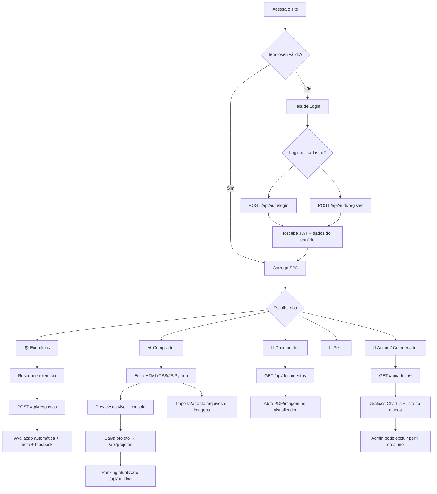
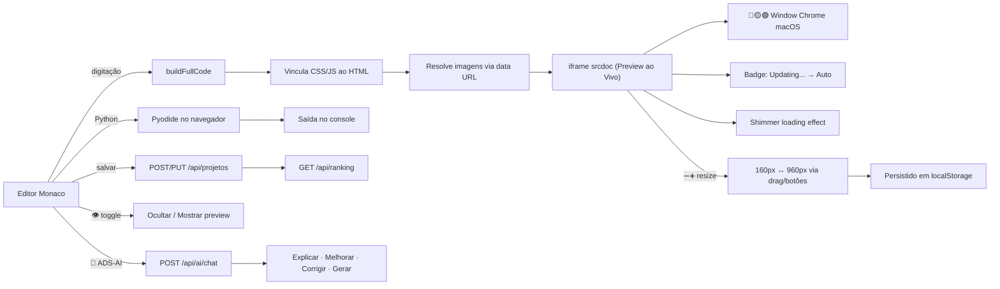

<div align="center">

# 🎓 ADS Anhanguera

### Plataforma Educacional Interativa

<br/>


<br/><br/>


<br/><br/>

Plataforma educacional completa para o curso de **Análise e Desenvolvimento de Sistemas** da **Universidade Anhanguera**. Reúne autenticação por perfis, exercícios interativos com avaliação automática, um **compilador/IDE web** com **preview ao vivo redimensionável**, **assistente de IA integrado (ADS-AI)**, ranking gamificado, painel administrativo com gráficos, biblioteca de documentos, avisos acadêmicos em destaque, visualizador do README e explorador de arquivos.

> **Atualização 2026.2:** a área autenticada recebeu uma modernização visual responsiva, preservando integralmente as funções existentes e mantendo inalteradas a identidade e as cores da tela de login. A plataforma também ganhou a aba **Avisos** e o papel restrito **Aluna Especial**.

<br/>

[Funcionalidades](#-funcionalidades) · [Fluxo do Projeto](#-fluxo-do-projeto-e-do-site) · [Arquitetura](#-arquitetura) · [Instalação](#-instalação-local) · [API](#-api-endpoints) · [Banco de Dados](#-banco-de-dados)

</div>

---

## 📋 Índice

- [Funcionalidades](#-funcionalidades)
  - [Interface modernizada e Avisos](#-interface-modernizada-e-avisos--novidade-v41)
  - [Preview ao Vivo](#-preview-ao-vivo--novidade-v40)
  - [Painel Redimensionável](#-painel-de-preview-redimensionável--novidade-v40)
  - [Assistente IA (ADS-AI)](#-assistente-de-ia-ads-ai--novidade-v40)
  - [Compilador / IDE Web](#-compilador--ide-web)
  - [Exercícios Interativos](#-exercícios-interativos)
  - [Ranking Gamificado](#-ranking-gamificado)
  - [Painel Administrativo](#-painel-administrativo)
  - [Biblioteca de Documentos](#-biblioteca-de-documentos)
- [Fluxo do Projeto e do Site](#-fluxo-do-projeto-e-do-site)
- [Arquitetura](#-arquitetura)
- [Tecnologias](#-tecnologias)
- [Estrutura do Projeto](#-estrutura-do-projeto)
- [Instalação Local](#-instalação-local)
- [Variáveis de Ambiente](#-variáveis-de-ambiente)
- [Deploy na Vercel](#-deploy-na-vercel)
- [Autenticação e Roles](#-autenticação-e-roles)
- [API Endpoints](#-api-endpoints)
- [Regras de Negócio](#-regras-de-negócio)
- [Banco de Dados](#-banco-de-dados)
- [Conteúdo Acadêmico](#-conteúdo-acadêmico)
- [Desenvolvedor](#-desenvolvedor)

---

## ✨ Funcionalidades

### ✨ Interface modernizada e Avisos — `NOVIDADE v4.1`

- Modernização visual isolada na área autenticada por meio de `public/app-modern.css`; a tela de login e suas cores permanecem inalteradas
- Nova hierarquia visual para cabeçalho, navegação, cards, botões, formulários, modais, editor e rodapé
- Layout responsivo para desktop, tablet e dispositivos móveis
- Nova aba **Avisos**, disponível para todos os perfis autenticados
- Galeria em destaque com resumo da aplicação 2026.2, calendário de provas presenciais e horário da coordenação
- Imagens com textos alternativos, carregamento adiado e adaptação responsiva
- Novo selo **ALUNA ESPECIAL**, com visualização dos projetos de outros alunos em modo somente leitura e edição limitada aos projetos próprios

---

### 🖥 Preview ao Vivo — `NOVIDADE v4.0`

> **Veja o resultado do seu código em tempo real, sem precisar clicar em nada.**

Um painel de visualização ao vivo fica posicionado abaixo do editor e do console, exibindo o resultado renderizado automaticamente conforme o aluno digita:

| Recurso | Detalhe |
|---------|---------|
| 🎨 **Window chrome macOS** | Barra de título com botões vermelho, amarelo e verde |
| 🔄 **Badge de auto-refresh** | Indicador de status: `Updating...` → `Auto` |
| ✨ **Efeito shimmer** | Animação suave de carregamento durante a atualização |
| 🔄 **Botão Refresh** | Força uma atualização manual do preview |
| 🔽 **Ocultar / Mostrar** | Recolhe ou expande o painel |
| 🌐 **Live Server** | Abre o projeto em tela cheia em nova aba |
| 👁 **Toggle rápido** | Botão na toolbar do editor para exibir/esconder o preview |

---

### 📐 Painel de Preview Redimensionável — `NOVIDADE v4.0`

> **Ajuste a altura do preview para o tamanho ideal do seu projeto.**

| Recurso | Detalhe |
|---------|---------|
| ➖➕ **Botões de tamanho** | `−` e `+` alteram a altura em passos de 80px |
| 📏 **Label de tamanho** | Mostra a altura atual (ex.: `480px`); clique duplo restaura o padrão |
| ↕️ **Arrastar para redimensionar** | Alça de grip na base do painel (com padrão visual de pontos) |
| 📱 **Suporte a toque** | Funciona em dispositivos móveis e tablets |
| 💾 **Persistência** | Altura salva em `localStorage` (mín. 160px / máx. 960px) |
| 🎞 **Animação suave** | Transições fluidas ao redimensionar |

---

### 🤖 Assistente de IA (ADS-AI) — `NOVIDADE v4.0`

> **Um tutor de IA integrado direto na sua IDE, alimentado pelo Llama 3.3 via Groq.**

| Recurso | Detalhe |
|---------|---------|
| 💬 **Chat interativo** | Painel lateral com conversa por texto |
| ⚡ **Ações rápidas** | Explicar código, sugerir melhorias, corrigir bugs, gerar exemplos |
| 🤖 **Botão flutuante** | Toggle com emoji de robô para abrir/fechar o painel |
| 🧠 **Modelo Llama 3.3** | Processamento de linguagem via API Groq (rápido e gratuito) |

---

### 🔐 Autenticação

- Login com e-mail e senha (hash bcrypt)
- Cadastro público de aluno pela tela **Criar Perfil**
- Validação de nome completo, formato de e-mail e e-mail duplicado no cadastro
- Tokens JWT com validade de 7 dias
- 3 níveis de acesso: **Admin**, **Coordenador** e **Aluno**
- Sessão persistente via `localStorage`

---

### 📚 Exercícios Interativos

- 4 unidades com exercícios de múltiplas etapas
- Cards de conceitos fundamentais por unidade, com modal expansível
- Avaliação automática por palavras-chave com nota de 0 a 10
- Feedback detalhado com acertos, sugestões e percentual
- Suporte a múltiplas tentativas por exercício
- CRUD completo de respostas (criar, ler, editar, excluir)
- Gabarito liberado para alunos após 3 tentativas ou nota 10

---

### 💻 Compilador / IDE Web

Editor de código embutido baseado no **Monaco Editor** (o mesmo motor do VS Code), agora com **preview ao vivo**, **painel redimensionável** e **assistente de IA**:

```
┌─────────────────────────────────────────────────────────┐
│  💻 Editor Monaco (HTML · CSS · JS · Python)            │
│  ┌─────────┬─────────┬──────────┬──────────┐            │
│  │ index.  │ style.  │ script.  │ main.py  │   👁 🤖    │
│  │ html    │ css     │ js       │          │            │
│  └─────────┴─────────┴──────────┴──────────┘            │
│                                                         │
│  ┌─ Console ──────────────────────────────────────────┐  │
│  │ > console.log, warn, error, info                   │  │
│  └────────────────────────────────────────────────────┘  │
│                                                         │
│  ┌─ 🖥 Preview ao Vivo ──────── 🔴🟡🟢 ──────────────┐  │
│  │  ╔═══════════════════════════════════════════╗      │  │
│  │  ║           Resultado renderizado           ║      │  │
│  │  ║         atualizado em tempo real           ║      │  │
│  │  ╚═══════════════════════════════════════════╝      │  │
│  │  [🔄 Refresh] [🔽 Ocultar] [🌐 Live] [−][480px][+] │  │
│  │  ┄┄┄┄┄┄┄┄ arrastar para redimensionar ┄┄┄┄┄┄┄┄    │  │
│  └────────────────────────────────────────────────────┘  │
│                                                         │
│  ┌─ 🤖 ADS-AI ───────────────────────────────────────┐  │
│  │  Assistente IA (Llama 3.3 / Groq)                 │  │
│  │  [Explicar] [Melhorar] [Corrigir] [Exemplo]       │  │
│  └────────────────────────────────────────────────────┘  │
└─────────────────────────────────────────────────────────┘
```

**Recursos do editor:**

- **4 linguagens**: HTML, CSS, JavaScript e **Python**, cada uma com aba própria
- **IntelliSense e snippets** customizados para as 4 linguagens
- **Preview ao vivo** com vínculo automático de CSS e JS ao HTML (resolve referências locais a `style.css`/`script.js`)
- **Console embutido** que captura `console.log/warn/error/info` e erros do preview
- **Execução de Python no navegador** via **Pyodide** (sem backend), com saída no console
- **Live Server**: abre o projeto renderizado em uma nova aba
- **Temas** claro/escuro do editor, zoom de fonte e auto-run com debounce
- **Importação de arquivos** por botão ou **arrastar e soltar** (`.html`, `.css`, `.js`, `.py` e imagens)
- **Suporte a imagens** de qualquer tipo (PNG, JPG, GIF, WebP, SVG, etc.): árvore de imagens, copiar caminho, inserir `` e remoção
- **Download** do projeto em ZIP e download individual de `index.html`, `style.css`, `script.js` e `main.py`
- **Persistência por aluno**: cada projeto é salvo no banco; professores podem publicar projetos visíveis a todos
- **Botões de apoio**: "Aprenda Front-End", "Hexadecimal e Binário" e "Os 3 Pilares do Bootstrap" (PDF)

---

### 🏆 Ranking Gamificado

- Ranking **horizontal em cards**, um por aluno, ordenado por projetos e linhas de código
- **Animações** especiais para 1º, 2º e 3º lugares (medalhas 🥇🥈🥉)
- Contabiliza projetos, linhas e palavras de código
- Botão para minimizar/expandir a visualização do ranking
- **Mensagem de incentivo dinâmica** que muda toda vez que alguém assume a liderança

---

### 📊 Painel Administrativo

- Dashboard com estatísticas gerais (alunos, respostas, média)
- Gráfico de barras — média de notas por unidade (Chart.js)
- Gráfico de linha — evolução individual do aluno (Chart.js)
- Lista de alunos com médias e totais
- Navegação pelos projetos de código de cada aluno
- Exclusão de perfil de aluno pelo admin, removendo também respostas e projetos vinculados
- Recálculo de notas pelo endpoint administrativo e pelo script local `scripts/recalcular-notas.js`
- Proteção do perfil do criador da plataforma, que permanece com o nível administrativo máximo

---

### 📄 Biblioteca de Documentos

- Documentos organizados por unidade em **cards coloridos** (ADS 1 a ADS 4 e Engenharia de Software)
- **ADS 4 — Interface e Usabilidade** servida diretamente da pasta do projeto
- **Engenharia de Software** com quatro atividades e quatro gabaritos, das unidades 1 a 4
- Suporte a PDF e imagens (PNG/JPG)
- Visualizador embutido via iframe
- Gabaritos identificados e ocultos na navegação para alunos, conforme a regra atual da interface
- Link externo **ESTUDE AQUI** para material complementar

---

### 🗂 Explorador de Arquivos

- Página `/explorer` que navega pela árvore de arquivos do projeto
- Leitura de arquivos de texto, imagens e PDFs (com proteção contra acesso indevido)
- Ignora arquivos/pastas sensíveis como `node_modules`, `.git`, `.env`, `.env.local` e `.env.production`

---

### 🎨 Interface

- Tema laranja Anhanguera (#F37021) em fundo claro
- Design responsivo (desktop, tablet e mobile)
- SPA (Single Page Application) com navegação por abas
- Menu suspenso de unidades, perfil com estatísticas e modal interno para ler o README
- Alternância de "Visão Aluno" / "Visão Admin" para coordenadores

---

## 🔄 Fluxo do Projeto e do Site

### Fluxo de inicialização (backend)

```
node server.js
  └─▶ startDBInit()
        ├─ conecta no Turso/libSQL
        ├─ cria tabelas (usuarios, respostas, projetos_codigo)
        ├─ executa migrations (tentativa, visto, py, assets)
        └─ seed de usuários
  └─▶ Express sobe rotas /api/* + estáticos de public/ + /explorer
```

### Fluxo de navegação do usuário (frontend SPA)



### Fluxo de uma resposta de exercício

```
Aluno escreve resposta
  → POST /api/respostas
  → avaliador.js compara palavras-chave do gabarito
  → calcula nota (0–10) + feedback + percentual
  → grava em respostas (incrementa tentativa)
  → retorna resultado ao aluno
```

### Fluxo do compilador + Preview ao Vivo + ADS-AI



---

## 🏗 Arquitetura

```
┌──────────────────────────┐     ┌──────────────┐     ┌────────────────┐
│        Frontend          │────▶│   Express 5  │────▶│  Turso/libSQL  │
│   Vanilla JS (SPA)       │◀────│   REST API   │◀────│   Cloud DB     │
│   Monaco · Pyodide       │     │   JWT Auth   │     │   SQLite Edge  │
│   Chart.js · Preview     │     │   Static     │     │                │
│   ADS-AI (Groq)          │     └──────────────┘     └────────────────┘
└──────────────────────────┘
            │
            ▼
  ┌───────────────────┐
  │     Groq API      │
  │   Llama 3.3 70B   │
  └───────────────────┘
```

- **Frontend**: HTML5 + CSS3 + JavaScript vanilla (SPA), Monaco Editor, Pyodide, Chart.js e Preview ao Vivo via CDN
- **Backend**: Node.js + Express 5 (API REST + arquivos estáticos)
- **Banco de Dados**: Turso (libSQL) — SQLite distribuído na edge
- **Autenticação**: bcryptjs (hash) + jsonwebtoken (JWT)
- **IA**: Llama 3.3 via Groq API (assistente ADS-AI)
- **Deploy**: Vercel (serverless)

---

## 🛠 Tecnologias

| Tecnologia | Versão | Uso |
|-----------|--------|-----|
| HTML5, CSS3 e JavaScript | Vanilla SPA | Interface, navegação, responsividade e interações sem framework frontend |
| Node.js | 18+ | Runtime do servidor |
| Express | 5.x | Framework HTTP / API REST |
| @libsql/client | 0.17+ | Cliente Turso/libSQL |
| bcryptjs | 2.4+ | Hash de senhas |
| jsonwebtoken | 9.0+ | Tokens JWT |
| dotenv | 17+ | Variáveis de ambiente |
| Monaco Editor | 0.45 (CDN) | Editor de código do compilador |
| Pyodide | 0.26 (CDN) | Execução de Python no navegador |
| Chart.js | 4.x (CDN) | Gráficos no painel admin |
| Groq API | HTTP | Backend do assistente ADS-AI (`llama-3.3-70b-versatile`) |
| marked | CDN | Renderização do README no modal da aplicação |

---

## 📁 Estrutura do Projeto

```
adsanhanguera/
├── server.js              # Servidor Express 5 (API + estáticos + explorer)
├── vercel.json            # Configuração de deploy Vercel (com includeFiles)
├── package.json           # Dependências e scripts (versão do pacote: 4.2.0)
├── .env                   # Variáveis de ambiente (não versionado)
├── README.md
│
├── src/
│   ├── auth.js            # Autenticação (bcrypt + JWT)
│   ├── permissions.js     # Matriz explícita de papéis, propriedade e autorizações
│   ├── database.js        # Conexão Turso + schema + migrations + seed
│   ├── gabaritos.js       # Banco de exercícios (perguntas, palavras-chave)
│   └── avaliador.js       # Motor de avaliação por palavras-chave
│
├── scripts/
│   └── recalcular-notas.js # Reavaliação em lote das respostas
│
├── public/
│   ├── index.html         # SPA (login/cadastro, abas, compilador, preview, AI chat)
│   ├── style.css          # Tema laranja Anhanguera + estilos do preview
│   ├── app-modern.css     # Camada visual moderna restrita à área autenticada
│   ├── app.js             # Lógica do frontend (auth, exercícios, compilador, preview, AI, ranking, docs)
│   ├── images/avisos/     # Imagens acadêmicas publicadas na aba Avisos
│   ├── explorer.html      # Explorador de arquivos
│   ├── explorer.css       # Estilos do explorador
│   └── docs/              # Biblioteca de documentos (ADS 1, 2, 3 e Engenharia de Software)
│       ├── ads1-projeto-software/
│       ├── ads2/
│       ├── ads3/
│       └── engenharia-de-software/
│
├── ADS 4/                 # Documentos da ADS 4 (servidos via /api/ads4-doc/)
│   └── INTERFACE E USABILIDADE/
└── Os 3 Pilares do Bootstrap.pdf  # Servido via /api/os-3-pilares-do-bootstrap.pdf
```

---

## 🚀 Instalação Local

### Pré-requisitos

- Node.js 18+ instalado
- Conta no [Turso](https://turso.tech) com banco criado

### Passos

```bash
# 1. Clonar o repositório
git clone https://github.com/dansfisica85/adsanhanguera.git
cd adsanhanguera

# 2. Instalar dependências
npm ci

# 3. Configurar variáveis de ambiente
# Criar manualmente um arquivo .env e inserir as configurações descritas abaixo

# 4. Iniciar o servidor
npm start
# 🚀 Servidor rodando em http://localhost:3000
```

> [!TIP]
> O banco de dados executa automaticamente a criação das tabelas e as migrações não destrutivas ao iniciar. A conexão Turso precisa estar configurada no arquivo `.env`.

---

## 🔑 Variáveis de Ambiente

Crie um arquivo `.env` na raiz do projeto:

```env
TURSO_DATABASE_URL=libsql://seu-banco.turso.io
TURSO_AUTH_TOKEN=seu-token-turso
GROQ_API_KEY=sua-chave-groq          # necessária para o ADS-AI
JWT_SECRET=sua-chave-secreta-jwt  # use um segredo forte e exclusivo em produção
PORT=3000                          # opcional, padrão 3000
```

### Na Vercel

Configure as mesmas variáveis em **Settings → Environment Variables**.

`JWT_SECRET` é obrigatório, deve ter pelo menos 32 caracteres e não possui valor de fallback no código.

---

## 🌐 Deploy na Vercel

### Via GitHub (recomendado)

1. Conecte o repositório no [Vercel Dashboard](https://vercel.com/dashboard)
2. Configure as variáveis de ambiente (`TURSO_DATABASE_URL`, `TURSO_AUTH_TOKEN`, `GROQ_API_KEY` para usar o ADS-AI)
3. O deploy é automático a cada push na branch `main`

> [!NOTE]
> O arquivo `vercel.json` já está configurado com as rotas e com `includeFiles` para empacotar a pasta `ADS 4/` e o PDF do Bootstrap na função serverless.

### Via CLI

```bash
npm i -g vercel
vercel login
vercel --prod
```

---

## 🔐 Autenticação e Roles

| Role | Permissões |
|------|-----------|
| **admin** | Nível máximo: CRUD de respostas e projetos, painel admin, gabaritos, marcação de "visto", gestão de alunos e documentos. O perfil do criador permanece protegido com esse nível máximo |
| **coordenador** | Alterna entre "Visão Aluno" e "Visão Admin" (leitura). **Não pode** criar/editar/excluir respostas ou projetos |
| **especial — Aluna Especial** | Exibe o selo **ALUNA ESPECIAL**. Visualiza projetos e gabaritos, abre os projetos dos demais em modo somente leitura e cria, edita ou exclui somente os próprios projetos. Não acessa respostas ou notas alheias, não corrige atividades, não marca "visto", não altera ou exclui usuários e não modifica projetos de terceiros |
| **aluno** | Cria perfil, responde exercícios, usa o compilador, salva projetos, vê ranking, exclui as próprias respostas e projetos |

### Fluxo de Autenticação

```
POST /api/auth/login
  → Verifica email + bcrypt hash
  → Retorna JWT (7 dias) + dados do usuário

POST /api/auth/register
  → Valida nome completo + e-mail + senha
  → Cria usuário com role aluno
  → Retorna JWT (7 dias) + dados do usuário

Cada request autenticada envia:
  Authorization: Bearer <token>
```

O servidor revalida o papel e a versão da sessão no banco. Trocas de senha
incrementam `token_version` e encerram imediatamente os tokens anteriores da conta.

---

## 📡 API Endpoints

### Autenticação

| Método | Rota | Auth | Descrição |
|--------|------|------|-----------|
| `POST` | `/api/auth/login` | ❌ | Login com email + senha |
| `POST` | `/api/auth/register` | ❌ | Criar perfil de aluno e retornar token |
| `GET` | `/api/auth/me` | ✅ | Verificar token / dados do usuário |

### Exercícios e Respostas

| Método | Rota | Auth | Descrição |
|--------|------|------|-----------|
| `GET` | `/api/exercicios/:unidade` | ❌ | Listar exercícios (sem gabarito) |
| `POST` | `/api/respostas` | ✅ | Enviar resposta + avaliação automática |
| `GET` | `/api/respostas` | ✅ | Listar respostas do usuário |
| `PUT` | `/api/respostas/:id` | ✅ | Editar resposta (reavaliar) |
| `DELETE` | `/api/respostas/:id` | ✅ | Excluir resposta |
| `GET` | `/api/gabarito/:u/:e/:ex` | ✅ | Ver gabarito (protegido por regra) |

### Compilador / Projetos de Código

| Método | Rota | Auth | Descrição |
|--------|------|------|-----------|
| `GET` | `/api/projetos` | ✅ | Listar projetos conforme o papel autenticado |
| `GET` | `/api/projetos/:id` | ✅ | Obter um projeto respeitando a permissão de leitura |
| `POST` | `/api/projetos` | ✅ | Criar projeto (html, css, js, py, assets) |
| `PUT` | `/api/projetos/:id` | ✅ | Atualizar projeto |
| `DELETE` | `/api/projetos/:id` | ✅ | Excluir projeto |
| `PUT` | `/api/projetos/:id/visto` | ✅ (admin) | Marcar/desmarcar "visto" |
| `GET` | `/api/projetos-alunos` | ✅ (admin/coord/especial) | Alunos com contagem de projetos |
| `GET` | `/api/projetos-aluno/:id` | ✅ (admin/coord/especial) | Projetos de um aluno; Aluna Especial recebe somente leitura |
| `GET` | `/api/projetos-admin` | ✅ | Projetos publicados pelo professor |
| `GET` | `/api/ranking` | ✅ | Ranking de alunos (projetos/linhas) |

### Administração

| Método | Rota | Auth | Role |
|--------|------|------|------|
| `POST` | `/api/admin/usuarios` | ✅ | admin; somente o criador concede o papel especial |
| `PATCH` | `/api/admin/usuarios/:id` | ✅ | somente o criador; atualiza a identidade do perfil especial preservando ID e projetos |
| `GET` | `/api/admin/alunos` | ✅ | admin, coordenador |
| `DELETE` | `/api/admin/alunos/:id` | ✅ | admin |
| `GET` | `/api/admin/alunos/:id/evolucao` | ✅ | admin, coordenador |
| `GET` | `/api/admin/estatisticas` | ✅ | admin, coordenador |
| `POST` | `/api/admin/recalcular` | ✅ | admin |

### Assistente de IA

| Método | Rota | Auth | Descrição |
|--------|------|------|-----------|
| `POST` | `/api/ai/chat` | ✅ | Chat ADS-AI com Groq, histórico recente e contexto opcional do código |

### Documentos, Explorer e Utilidades

| Método | Rota | Auth | Descrição |
|--------|------|------|-----------|
| `GET` | `/api/documentos` | ❌ | Lista documentos por categoria (ADS 1–4 e Engenharia de Software) |
| `GET` | `/api/ads4-doc/:file` | ❌ | Serve um PDF da ADS 4 |
| `GET` | `/api/os-3-pilares-do-bootstrap.pdf` | ❌ | PDF "Os 3 Pilares do Bootstrap" |
| `GET` | `/api/explorer/tree` | ❌ | Árvore de arquivos do projeto |
| `GET` | `/api/explorer/file` | ❌ | Conteúdo de um arquivo |
| `GET` | `/api/readme` | ❌ | Conteúdo do README.md |
| `GET` | `/api/health` | ❌ | Status do servidor/banco |
| `GET` | `/explorer` | ❌ | Página do explorador de arquivos |
| `GET` | `/{*splat}` | ❌ | Fallback da SPA para `public/index.html` |

---

## 📏 Regras de Negócio

### Gabarito Protegido

- **Admin/Coordenador**: Sempre podem ver o gabarito
- **Aluno**: Precisa de **3 ou mais tentativas** ou de **nota 10** para desbloquear o gabarito

### Coordenador — Visão Dupla

- Alterna entre "Visão Aluno" e "Visão Admin" (leitura)
- **Bloqueado** de criar, editar ou excluir respostas e projetos (retorna 403)

### Avaliação Automática

- Respostas avaliadas por correspondência de **palavras-chave**
- Nota proporcional ao número de palavras-chave encontradas
- Feedback inclui nota, percentual, acertos, sugestões e gabarito resumido

### Compilador, Preview e Ranking

- Cada aluno mantém seus próprios projetos; o professor pode publicar projetos visíveis a todos (somente leitura para alunos)
- Imagens são armazenadas junto ao projeto (coluna `assets`, em JSON com data URLs)
- O ranking conta projetos e linhas de código por aluno; a mensagem de liderança muda quando há troca de líder
- O **preview ao vivo** atualiza automaticamente a cada alteração no código (com debounce)
- A **altura do preview** é persistida em `localStorage` e pode ser ajustada entre 160px e 960px
- O **assistente ADS-AI** utiliza o Llama 3.3 via Groq para oferecer ações rápidas sobre o código do aluno
- Se `GROQ_API_KEY` não estiver configurada, o endpoint de IA retorna `503` informando que o serviço não está configurado

### Resiliência e Operação

- O backend inicializa o banco de forma assíncrona, expõe `/api/health` antes do middleware de banco e tenta reinicializar caso a conexão falhe
- Operações no Turso/libSQL usam retry com backoff exponencial para erros transitórios de rede
- O frontend usa `fetchWithRetry` para repetir chamadas com erro 503 ou falhas temporárias de rede
- O handler global de erros força respostas JSON, evitando páginas HTML de erro em chamadas da API

---

## 🗃 Banco de Dados

### Tabela `usuarios`

```sql
CREATE TABLE usuarios (
  id INTEGER PRIMARY KEY AUTOINCREMENT,
  nome TEXT NOT NULL,
  email TEXT UNIQUE NOT NULL,
  senha_hash TEXT NOT NULL,
  role TEXT NOT NULL DEFAULT 'aluno',
  criado_em TEXT DEFAULT (datetime('now'))
);
```

### Tabela `respostas`

```sql
CREATE TABLE respostas (
  id INTEGER PRIMARY KEY AUTOINCREMENT,
  aluno_id INTEGER NOT NULL,
  unidade INTEGER NOT NULL,
  etapa INTEGER NOT NULL,
  exercicio INTEGER NOT NULL,
  resposta TEXT NOT NULL,
  nota REAL DEFAULT 0,
  feedback TEXT DEFAULT '',
  tentativa INTEGER DEFAULT 1,
  enviado_em TEXT DEFAULT (datetime('now')),
  FOREIGN KEY (aluno_id) REFERENCES usuarios(id)
);
```

### Tabela `projetos_codigo`

```sql
CREATE TABLE projetos_codigo (
  id INTEGER PRIMARY KEY AUTOINCREMENT,
  aluno_id INTEGER NOT NULL,
  nome TEXT NOT NULL DEFAULT 'Meu Projeto',
  html TEXT DEFAULT '',
  css TEXT DEFAULT '',
  js TEXT DEFAULT '',
  py TEXT DEFAULT '',          -- migration: código Python
  assets TEXT DEFAULT '',      -- migration: imagens (JSON com data URLs)
  visto INTEGER DEFAULT 0,     -- migration: marcado pelo professor
  atualizado_em TEXT DEFAULT (datetime('now')),
  criado_em TEXT DEFAULT (datetime('now'))
);
```

> [!NOTE]
> As colunas `py`, `assets`, `visto` (e `tentativa` em `respostas`) são adicionadas via **migrations não destrutivas** (`ALTER TABLE ADD COLUMN`), preservando os dados existentes.

---

## 📖 Conteúdo Acadêmico

| Unidade | Tema |
|---------|------|
| **ADS 1** | Projeto de Software — ciclos de vida, requisitos, estudo de caso |
| **ADS 2** | Resolução de Problemas — metodologias ágeis, elicitação de requisitos |
| **ADS 3** | Simulação Profissional — decisão técnica, comunicação com stakeholders |
| **ADS 4** | Interface e Usabilidade — fundamentos, planejamento, prototipação, testes e gamificação |
| **Engenharia de Software** | Introdução à engenharia, qualidade, testes e tópicos avançados — atividades e gabaritos das unidades 1 a 4 |

---

## 👨‍💻 Desenvolvedor

<div align="center">

**Davi Antonino Nunes da Silva**

| Canal | Contato |
|-------|---------|
| 📧 Email | [professordavi85@gmail.com](mailto:professordavi85@gmail.com) |
| 📱 WhatsApp | [(16) 99260-4315](https://wa.me/5516992604315) |
| 🎵 Spotify | [Artigli Notturni 🐾](https://open.spotify.com/artist/artiglinotturni) |
| 🐙 GitHub | [dansfisica85](https://github.com/dansfisica85) |

</div>

---

<div align="center">

## 📄 Licença

ISC © 2026 — Davi Antonino Nunes da Silva

<br/>

<sub>Feito com 🧡 para a Universidade Anhanguera</sub>

</div>
